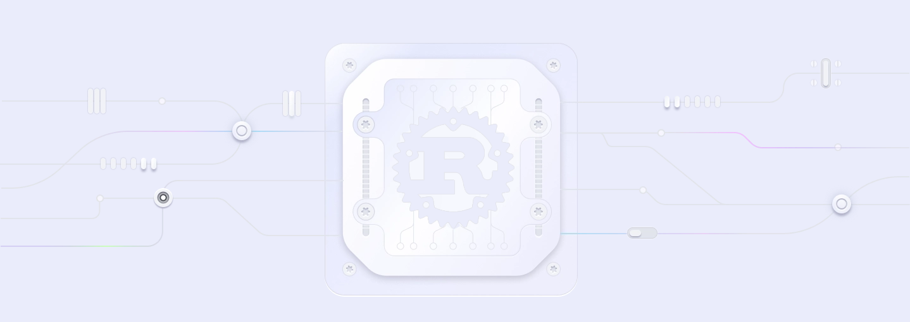

# Dfns SDK Rust

  

**Modular, extensible, and easy-to-use Rust SDK for the Dfns API.**



> **Warning**: This SDK is currently under development and not ready for production use. The API is subject to change. This SDK is not fully implemented and missing tests.

- [Dfns Website](https://www.dfns.co)
- [Dfns API Docs](https://docs.dfns.co)

## Installation

```bash
cargo add dfns-sdk-rs
```

## Examples

Check out the list of all examples in [this repository](https://github.com/deltartificial/dfns-sdk-rs-examples).

##### Wallets

- [x] [List Wallets](https://github.com/deltartificial/dfns-sdk-rs-examples/blob/master/examples/wallets/list_wallets.rs) - Demonstrates how to retrieve a list of wallets
- [x] [Create Wallet](https://github.com/deltartificial/dfns-sdk-rs-examples/blob/master/examples/wallets/create_wallet.rs) - Shows how to create a new wallet
- [x] [Get Wallet](https://github.com/deltartificial/dfns-sdk-rs-examples/blob/master/examples/wallets/get_wallet.rs) - Retrieves details of a specific wallet
- [x] [Update Wallet](https://github.com/deltartificial/dfns-sdk-rs-examples/blob/master/examples/wallets/update_wallet.rs) - Updates wallet information
- [x] [Tag Wallet](https://github.com/deltartificial/dfns-sdk-rs-examples/blob/master/examples/wallets/tag_wallet.rs) - Adds tags to a wallet
- [x] [Untag Wallet](https://github.com/deltartificial/dfns-sdk-rs-examples/blob/master/examples/wallets/untag_wallet.rs) - Removes tags from a wallet
- [x] [Get Wallet Assets](https://github.com/deltartificial/dfns-sdk-rs-examples/blob/master/examples/wallets/get_wallet_assets.rs) - Lists assets in a wallet
- [x] [Get Wallet History](https://github.com/deltartificial/dfns-sdk-rs-examples/blob/master/examples/wallets/get_wallet_history.rs) - Shows transaction history
- [x] [Get Wallet NFTs](https://github.com/deltartificial/dfns-sdk-rs-examples/blob/master/examples/wallets/get_wallet_nfts.rs) - Lists NFTs in a wallet
- [x] [Transfer Asset](https://github.com/deltartificial/dfns-sdk-rs-examples/blob/master/examples/wallets/transfer_asset.rs) - Transfers assets between wallets
- [x] [Broadcast Transaction](https://github.com/deltartificial/dfns-sdk-rs-examples/blob/master/examples/wallets/broadcast_transaction.rs) - Broadcasts a transaction
- [x] [Generate Signature](https://github.com/deltartificial/dfns-sdk-rs-examples/blob/master/examples/wallets/generate_signature.rs) - Generates a signature
- [x] [Get Signature](https://github.com/deltartificial/dfns-sdk-rs-examples/blob/master/examples/wallets/get_signature.rs) - Retrieves a specific signature
- [x] [List Signatures](https://github.com/deltartificial/dfns-sdk-rs-examples/blob/master/examples/wallets/list_signatures.rs) - Lists all signatures
- [x] [Get Transaction](https://github.com/deltartificial/dfns-sdk-rs-examples/blob/master/examples/wallets/get_transaction.rs) - Gets transaction details
- [x] [List Transactions](https://github.com/deltartificial/dfns-sdk-rs-examples/blob/master/examples/wallets/list_transactions.rs) - Lists all transactions
- [x] [Get Transfer](https://github.com/deltartificial/dfns-sdk-rs-examples/blob/master/examples/wallets/get_transfer.rs) - Gets transfer details
- [x] [List Transfers](https://github.com/deltartificial/dfns-sdk-rs-examples/blob/master/examples/wallets/list_transfers.rs) - Lists all transfers
- [x] [Export Wallet](https://github.com/deltartificial/dfns-sdk-rs-examples/blob/master/examples/wallets/export_wallet.rs) - Exports a wallet
- [x] [Import Wallet](https://github.com/deltartificial/dfns-sdk-rs-examples/blob/master/examples/wallets/import_wallet.rs) - Imports a wallet
- [x] [Delegate Wallet](https://github.com/deltartificial/dfns-sdk-rs-examples/blob/master/examples/wallets/delegate_wallet.rs) - Delegates wallet control

##### Webhooks

- [x] [Create Webhook](https://github.com/deltartificial/dfns-sdk-rs-examples/blob/master/examples/webhooks/create_webhook.rs) - Creates a new webhook
- [x] [Get Webhook](https://github.com/deltartificial/dfns-sdk-rs-examples/blob/master/examples/webhooks/get_webhook.rs) - Gets webhook details
- [x] [Update Webhook](https://github.com/deltartificial/dfns-sdk-rs-examples/blob/master/examples/webhooks/update_webhook.rs) - Updates webhook configuration
- [x] [Delete Webhook](https://github.com/deltartificial/dfns-sdk-rs-examples/blob/master/examples/webhooks/delete_webhook.rs) - Deletes a webhook
- [x] [List Webhooks](https://github.com/deltartificial/dfns-sdk-rs-examples/blob/master/examples/webhooks/list_webhooks.rs) - Lists all webhooks
- [x] [Ping Webhook](https://github.com/deltartificial/dfns-sdk-rs-examples/blob/master/examples/webhooks/ping_webhook.rs) - Tests webhook connectivity
- [x] [Get Webhook Event](https://github.com/deltartificial/dfns-sdk-rs-examples/blob/master/examples/webhooks/get_webhook_event.rs) - Gets webhook event details
- [x] [List Webhook Events](https://github.com/deltartificial/dfns-sdk-rs-examples/blob/master/examples/webhooks/list_webhook_events.rs) - Lists webhook events

## Usage

Here's a simple example of how to use the SDK:

```rust
use dfns_sdk_rs::{
    DfnsApiClient, DfnsBaseApiOptions, CredentialSigner,
    models::wallets::CreateWalletRequest,
};
use std::sync::Arc;

#[tokio::main]
async fn main() -> Result<(), Box<dyn std::error::Error>> {
    // Initialize your signer (implementation depends on your use case)
    let signer = Arc::new(YourCredentialSigner::new());

    // Create API client
    let client = DfnsApiClient::new(
        DfnsBaseApiOptions {
            base_url: "https://api.dfns.io".to_string(),
            app_id: "ap-2ng9jv-80cfc-983pop0iauf2sv8r".to_string(),
            auth_token: "your-auth-token".to_string(),
        },
        Some(signer),
    );

    // Create a wallet
    let wallet = client
        .wallets()
        .create_wallet(CreateWalletRequest {
            network: "EthereumSepolia".to_string(),
        })
        .await?;

    // Get wallet assets
    let assets = client
        .wallets()
        .get_wallet_assets(wallet.id)
        .await?;

    println!("Wallet assets: {:?}", assets);
    Ok(())
}
```

The example above demonstrates:

- Creating an API client with authentication
- Creating a new wallet
- Retrieving wallet assets

## Documentation

### Generating Documentation

To generate the documentation locally, you'll need the nightly Rust toolchain. Here's how to set it up:

```bash
# Install and switch to nightly Rust
rustup install nightly
rustup default nightly

# Generate the documentation
RUSTDOCFLAGS="--enable-index-page -Zunstable-options" cargo doc --no-deps --document-private-items --target-dir ./docs
```

### Viewing Documentation

To view the documentation in your browser:

```bash
# Start a local server (Python required)
python3 -m http.server 8000 --directory ./docs/doc
```

Then open [http://localhost:8000/dfns_sdk_rs/](http://localhost:8000/dfns_sdk_rs/) in your browser.

For more examples and detailed API documentation, check the [documentation section](#documentation).
